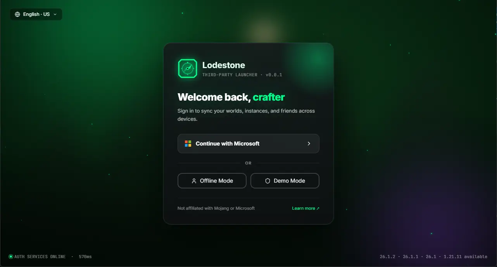
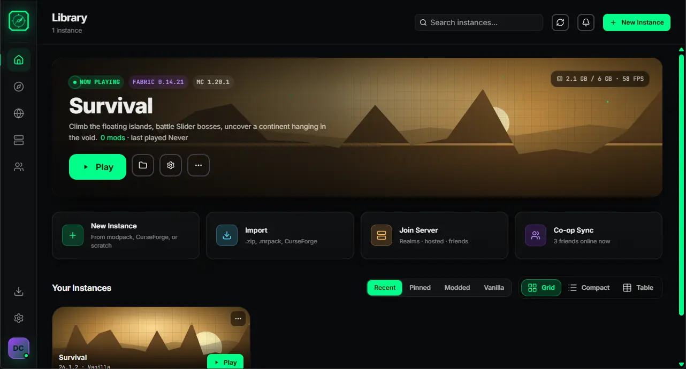
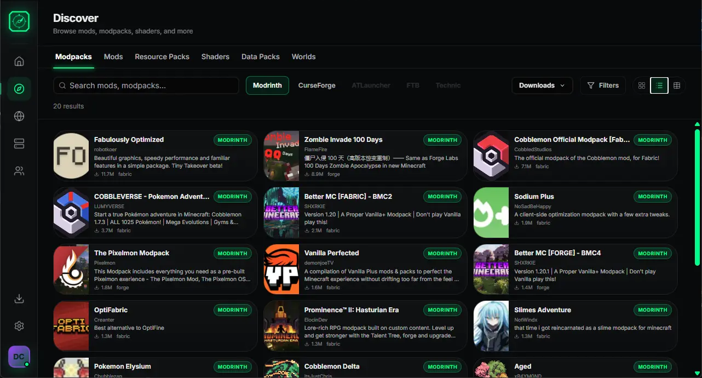
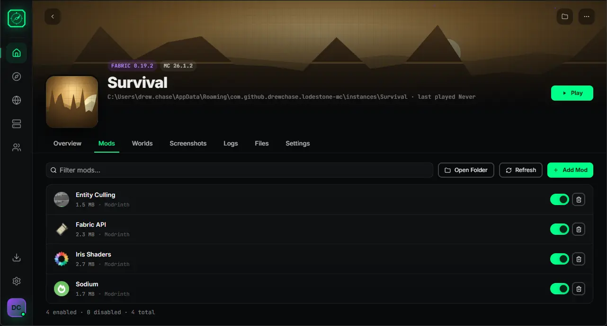
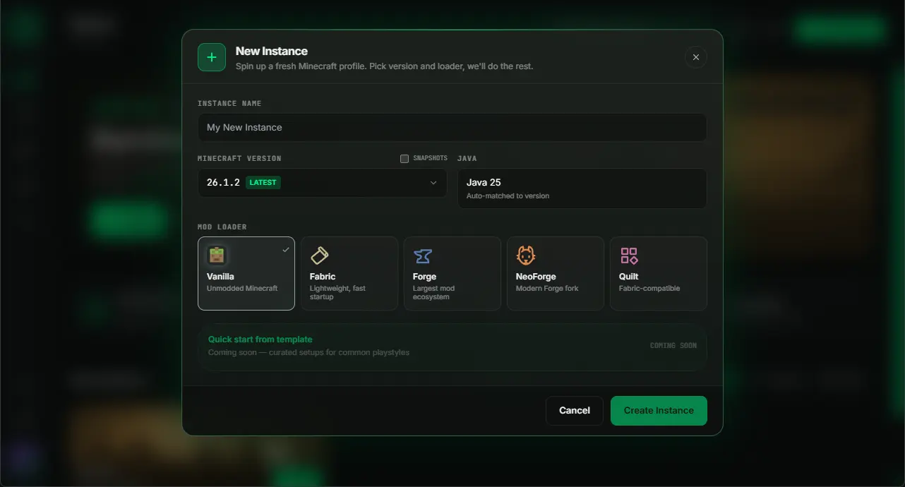
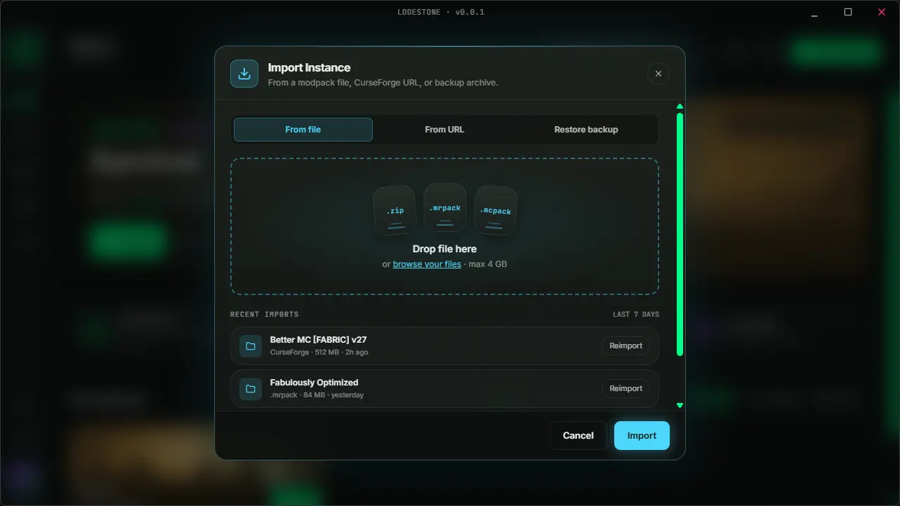
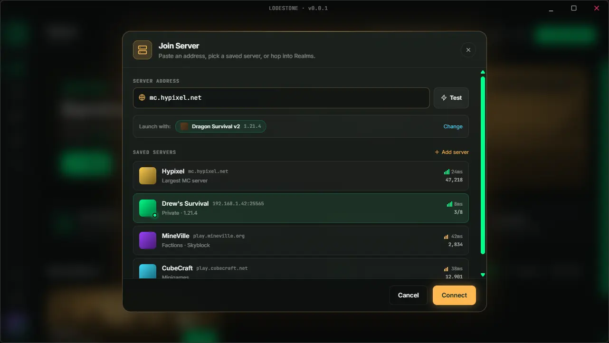
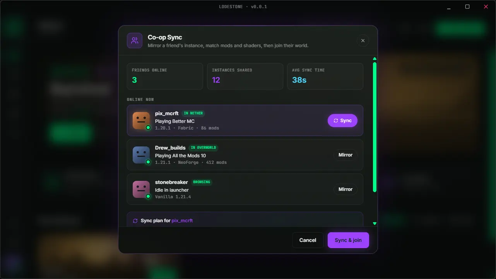

<p align="center">
  
</p>

<h1 align="center">Lodestone Minecraft Launcher</h1>

<p align="center">
  A modern, cross-platform Minecraft launcher built with Rust and React.
  <br />
  Manage instances, discover mods, sync with friends, and launch the game — all from one place.
</p>

---

## Screenshots

<p align="center">
  
  <br /><em>Sign in with Microsoft, play offline, or explore in demo mode.</em>
</p>

<p align="center">
  
  <br /><em>Your instance library — launch, manage, and organize your Minecraft profiles.</em>
</p>

<p align="center">
  
  <br /><em>Browse mods, modpacks, shaders, resource packs, and more from Modrinth, CurseForge, ATLauncher, FTB, and Technic.</em>
</p>

<p align="center">
  
  <br /><em>Per-instance mod management with enable/disable toggles.</em>
</p>

<p align="center">
  
  <br /><em>Create a new instance — pick your version and mod loader.</em>
</p>

<p align="center">
  
  <br /><em>Import instances from .zip, .mrpack, .mcpack files or URLs.</em>
</p>

<p align="center">
  
  <br /><em>Quick-connect to servers with saved server list and ping info.</em>
</p>

<p align="center">
  
  <br /><em>Co-op Sync — mirror a friend's mods, shaders, and instance, then join their world.</em>
</p>

---

## Features

- **Instance Management** — Create, import, duplicate, and organize Minecraft instances with full mod loader support.
- **Mod Loaders** — First-class support for Fabric, Forge, NeoForge, and Quilt.
- **Content Discovery** — Unified search across Modrinth, CurseForge, ATLauncher, FTB, and Technic Pack in a single browser.
- **Mod Management** — Per-instance mod lists with enable/disable toggles, drag-and-drop import, and one-click updates.
- **Co-op Sync** — Mirror a friend's instance (mods, shaders, resource packs) and join their world in one click.
- **Server Browser** — Save servers, check ping and player counts, and launch directly into multiplayer.
- **Microsoft Authentication** — Secure OAuth2 login via Microsoft, with offline and demo mode options.
- **Instance Import/Export** — Import from `.zip`, `.mrpack`, `.mcpack`, CurseForge URLs, or backup archives.
- **Auto Java Detection** — Automatically detects and matches the correct Java version for each instance.
- **Cross-Platform** — Built with Tauri for native performance on Windows, macOS, and Linux.

---

## Architecture

Lodestone is a Rust workspace with 7 crates:

| Crate | Description |
|-------|-------------|
| **lodestone-core** | Core library — instance management, database (SQLite), and Minecraft lifecycle |
| **lodestone-gui** | Desktop application — Tauri 2 + React + TypeScript + Tailwind CSS |
| **lodestone-website** | Marketing site & web launcher — Actix-web + React + Vite |
| **hopper-mc** | Content aggregator — unified API across Modrinth, CurseForge, ATLauncher, FTB, Technic |
| **emerald-auth** | Microsoft OAuth2 authentication library |
| **minecraft-loaders** | Fabric, Forge, NeoForge, and Quilt loader installation and management |
| **lodestone-cli** | Command-line interface (WIP) |

### Tech Stack

- **Backend**: Rust, Tokio, SQLx (SQLite), Actix-web
- **Frontend**: React 18, TypeScript, Tailwind CSS, HeroUI
- **Desktop**: Tauri 2
- **Build**: Cargo workspace, Vite, pnpm

---

## Getting Started

### Prerequisites

- [Rust](https://rustup.rs/) (stable)
- [Node.js](https://nodejs.org/) (v18+)
- [pnpm](https://pnpm.io/)
- [Tauri CLI](https://tauri.app/start/) (`cargo install tauri-cli`)

### Build & Run the Desktop App

```bash
# Clone the repository
git clone https://github.com/drew-chase/lodestone-minecraft-launcher.git
cd lodestone-minecraft-launcher

# Install frontend dependencies
cd crates/lodestone-gui && pnpm install && cd ../..

# Run in development mode
cd crates/lodestone-gui && cargo tauri dev
```

### Build for Production

```bash
cd crates/lodestone-gui && cargo tauri build
```

### Run the Website

```bash
cd crates/lodestone-website && pnpm install
cargo run -p lodestone-website
```

---

## License

This project is open source. See the repository for license details.
